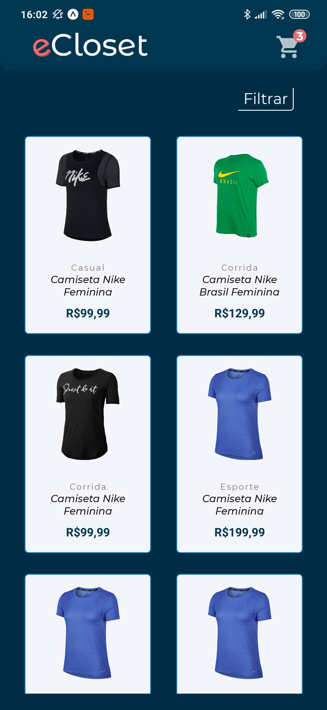
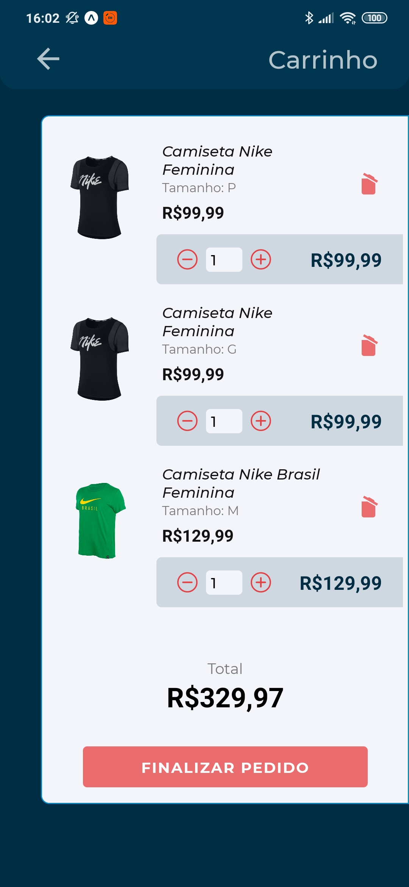
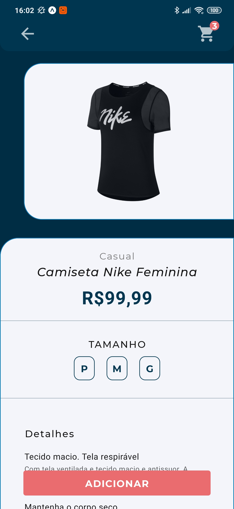

<div align="center">
  
</div>

<p align="center">
    
</p>
<p align="center">
  <a href="#rodando-o-projeto-localmente">Rodando o projeto localmente</a>&nbsp;&nbsp;&nbsp;|&nbsp;&nbsp;&nbsp;
  <a href="#tecnologias-utilizadas">Tecnologias</a>&nbsp;&nbsp;&nbsp;|&nbsp;&nbsp;&nbsp;
</p>
<div align="center">




</div>
</div>

O eCloset é um projeto de e-commerce para uma loja de roupas.

## Funcionalidades do Frontend

- Vizualização dos produtos disponíveis
- Adicionar produto ao carrinho de compras
- Verifica se existe a quantidade pedida do produto no estoque antes de adicionar ao carrinho
- Possibilidade de editar a quantidade do produto no carrinho e removê-lo do carrinho
- Apresenta o valor total da compra e o sub-total para cada item do carrinho

## Funcionalidades do Backend

- Cadastro de produtos
- Criar e modificar estoques para os produtos cadastrados

## Rodando o projeto localmente

## Pré requisitos

### Para executar o software localmente, são necessárias as seguintes ferramentas:

<li>
<a href="https://expo.io/tools#client">Expo Client</a>

Aplicativo disponível na Apple Store e na Play Store para vizualizar apps criados com o expo.
Como segunda opção, o expo disponibiliza a possibilidade de utilizar emuladores para rodar a aplicação.

</li>

<li>
<a href="https://expo.io/tools#cli">Expo CLI</a>
</li>

<li>
<a href="https://laravel.com/docs/7.x">Laravel</a>
</li>

<li>
<a href="https://nodejs.org/en/download/">NodeJS (Utilizar a versão LTS)</a>
</li>

<li>
  <a href="https://classic.yarnpkg.com/en/docs/install/#debian-stable">Yarn</a>
</li>

<li>Banco de dados Postgres:</li>
 <ul>
 <strong>Opção 1</strong>
<li>
<a href="https://docs.docker.com/engine/install/">Docker + Postgres</a>
</li>
Após instalar e configurar o docker, criar um container Postgres com o seguinte comando:

```
docker run --name {NOME_DO_CONTAINER} -e "POSTGRES_PASSWORD={SENHA_DO_BANCO}" -p 5432:5432 -d postgres
```

E criar um banco de dados Postgres dentro do container via linha de comando ou interfaces gráficas como <a href="https://www.pgadmin.org/download/">pgAdmin</a>, <a href="https://www.electronjs.org/apps/postbird">postbird</a> (recomendado) e etc.

<strong>Opção 2</strong>

<li>
<a href="https://www.postgresql.org/download/">PostgreSQL</a>
</li>
Utilizar o postgreSQL via linha de comando, pgAdmin e afins e criar um banco de dados. É importante ter os dados
de host, porta, usuário, senha e nome do banco de dados.
 </ul>

## Instalação

### 1 - Baixe o repositório

```bash
git clone https://github.com/richardjlv/eCloset.git
```

### 2 - Navegue para a pasta do projeto

```
cd eCloset
```

### 3 - Instale as dependências

Dentro da pasta server:

```
composer install
```

Dentro da pasta mobile:

```
yarn
```

### 4 - Configurar o ambiente do backend

Configuração das variáveis de ambiente do banco de dados (Postgres):

Copiar o arquivo .env.example para o arquivo .env na raiz da pasta server e modificar as seguintes variáveis:

```
APP_URL=http://{SEU_IP_AQUI} (Ex.: 192.168.0.00)

DB_CONNECTION={ BANCO DE DADOS }
DB_HOST=127.0.0.1
DB_PORT={ PORTA DO BANCO DE DADOS }
DB_DATABASE={ NOME DO BANCO DE DADOS }
DB_USERNAME={ USUÁRIO DO BANCO DE DADOS }
DB_PASSWORD={ SENHA DO BANCO DE DADOS }
```

Rodar os seguintes comandos dentro da pasta server:

```
php artisan migrate
```

### 5 - Configurar o ambiente do mobile

Copiar o arquivo .env.example para o arquivo .env na raiz da pasta server e modificar as seguintes variáveis:

```
API_URL={SEU_IP_AQUI}
```

### 6 - Execute o backend

Dentro da pasta server:

```
php artisan server
```

### 7 - Execute o mobile

Dentro da pasta mobile:

```
yarn start --clear
```


## Tecnologias utilizadas

- [Laravel](https://laravel.com/) - PHP Framework
- [Docker](https://www.docker.com/) - Conteinerização do postgreSQL
- [React Native](https://reactnative.dev/) - Framework utilizado no frontend
- [Expo](https://expo.io/) - Ferramenta de desenvolvimento utilizando React Native
- [Styled components](https://styled-components.com/) - Estilização de componentes no react native
- [Reactotron](https://github.com/infinitered/reactotron) - Ferramenta de debug do frontend
